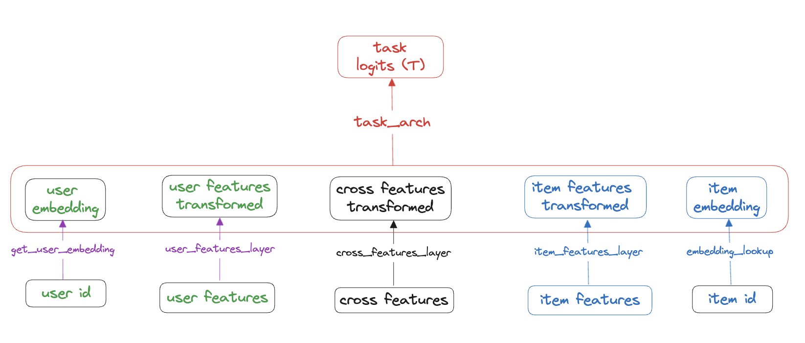
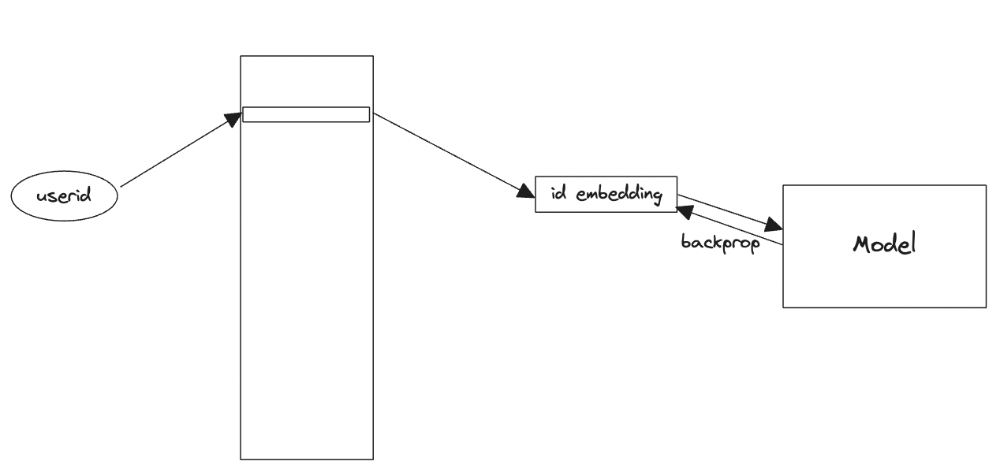
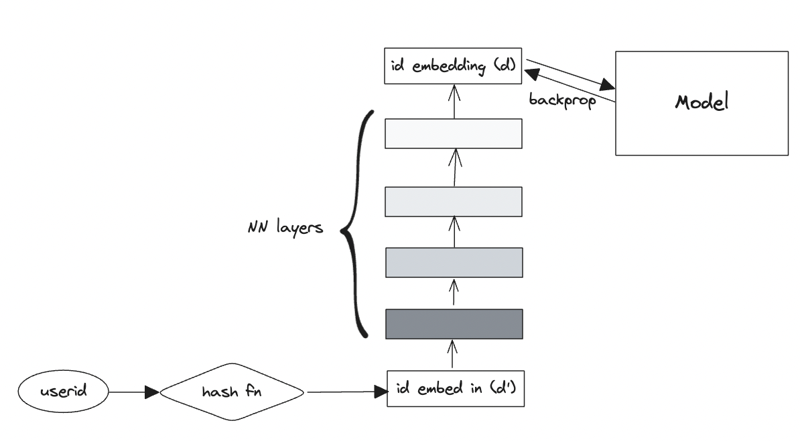
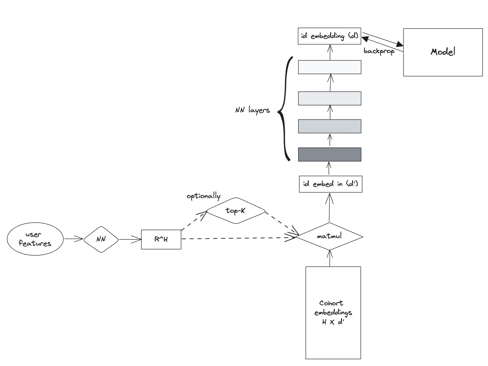
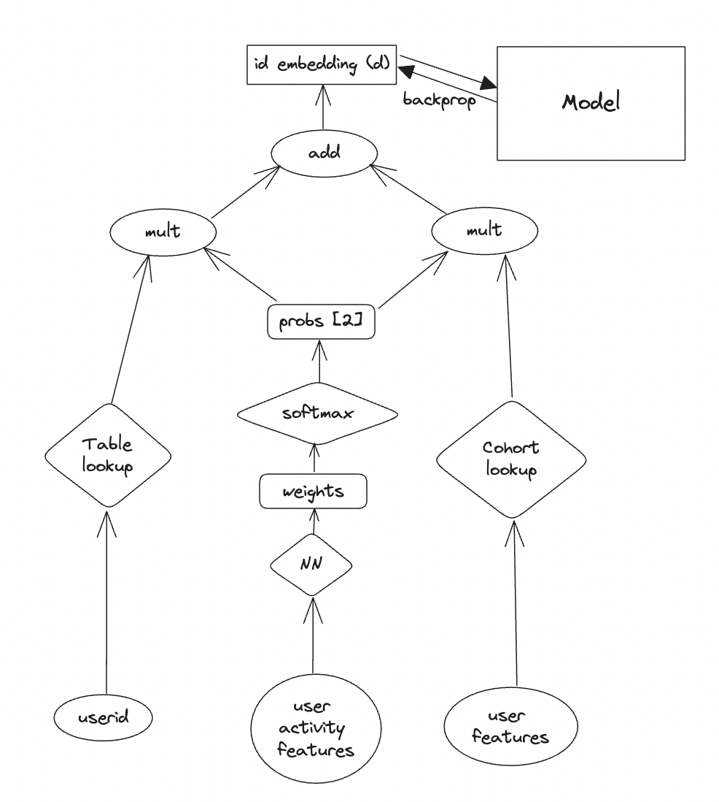

# Multiple ways to model user preference in recommender systems

Modeling the preference of the user as an input to the retrieval or ranking model has been a successful strategy in recommender systems. In this repo, we will show how to do it effectively. We will use the example of a ranking model but the approach equally applies to a retrieval model. The overall schematic of a ranking model is in 

The conventional approach of representing a user is using an embedding table lookup as shown in the image below and implemented in [multi_task_estimator.py](./src/multi_task_estimator.py).

We will also look at the schematic of an implementation using Deep Hash Embeddings.

Then we will look at an approach where we reuse the machinery of Deep Hash Embeddings but seed it with an embedding that is looked up in a relatively small table as a function of the user's features (not including user id)

Finally we will put id lookup and cohort lookup together using and idea from [this paper from Google](https://arxiv.org/abs/2210.14309). This image from the paper captures the idea:

The implementation in our repository is:

### Customization
If you want to allocate more of your memorization capacity to a certain cohort, for instance you could care more about US users, you could do that by encoding the weight in the loss function and perhaps adding the country / feature in the input to the Mixture of Representations tower.

## Contributing

Run `pytest tests/*` from main directory before submitting a PR.
